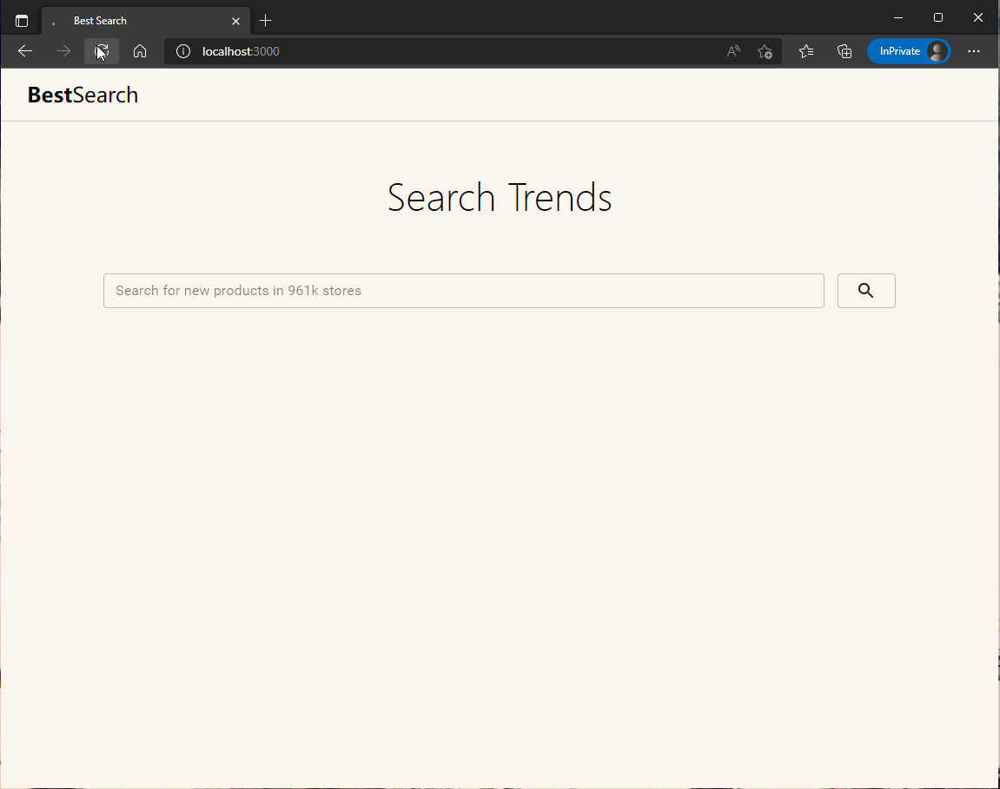

# Best Search React App

> 效果图 [在线预览](https://jiaiyan.github.io/best-search/)

<div align="center">
  
</div>

#### 使用以下技术/packages完成：
- [ReactJS](https://www.react.org/) 
  - [create-react-app](https://reactjs.org/docs/create-a-new-react-app.html)
  - 全部使用[Function Components](https://reactjs.org/docs/components-and-props.html) ([Hooks](https://reactjs.org/docs/hooks-intro.html))，避免使用Class Components
- [React Router](https://reactrouter.com/web/guides/quick-start)
- [React Redux](https://react-redux.js.org/)
- [Redux Thunk](https://redux.js.org/tutorials/fundamentals/part-6-async-logic#using-the-redux-thunk-middleware) (Middleware)
- [Material UI](https://material-ui.com/)

## 执行脚本

### `npm install`
安装依赖

### `npm start`
开发运行

### `npm run build`
构建项目

## 目录结构


```
best-search
├─README.md
├─package-lock.json
├─package.json
├─tsconfig.json
├─yarn.lock
├─src
|  ├─App.tsx
|  ├─index.css
|  ├─index.tsx
|  ├─react-app-env.d.ts
|  ├─reportWebVitals.ts
|  ├─setupTests.ts
|  ├─utils
|  |   └axios.ts
|  ├─store
|  |   ├─actions.ts
|  |   ├─index.ts
|  |   ├─reducers.ts
|  |   └types.ts
|  ├─routes
|  |   └index.ts
|  ├─pages
|  |   ├─index.ts
|  |   ├─search
|  |   |   ├─index.scss
|  |   |   └index.tsx
|  |   ├─notFound
|  |   |    └index.tsx
|  |   ├─home
|  |   |  ├─index.scss
|  |   |  └index.tsx
|  ├─layout
|  |   ├─index.scss
|  |   └index.tsx
|  ├─components
|  |     ├─SearchInput
|  |     |      ├─index.scss
|  |     |      └index.tsx
|  |     ├─Product
|  |     |    ├─index.tsx
|  |     |    ├─Trends
|  |     |    |   └index.tsx
|  |     |    ├─Trend
|  |     |    |   ├─index.scss
|  |     |    |   └index.tsx
|  ├─api
|  |  └search.ts
├─scripts
|    ├─build.js
|    ├─start.js
|    └test.js
├─public
|   ├─favicon.ico
|   ├─index.html
|   ├─logo192.png
|   ├─logo512.png
|   ├─manifest.json
|   └robots.txt
├─pics
|  └best-search-preview.gif
├─config
|   ├─env.js
|   ├─getHttpsConfig.js
|   ├─modules.js
|   ├─paths.js
|   ├─webpack.config.js
|   ├─webpackDevServer.config.js
|   ├─webpack
|   |    ├─persistentCache
|   |    |        └createEnvironmentHash.js
|   ├─jest
|   |  ├─babelTransform.js
|   |  ├─cssTransform.js
|   |  └fileTransform.js

```